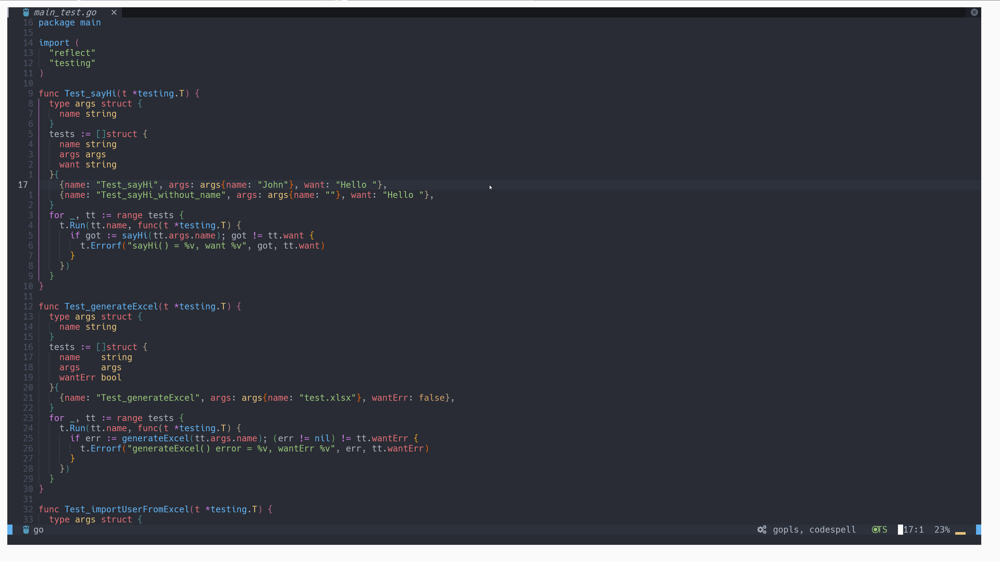

# Auto running go test



This plugin can be enabled on the go_test file. And auto running go background to check test, the test result will be show on the each test line.

How to use this, use package manager. Adding following line into `init.lua`

```lua
use { 'Azrealy/go-autotest.nvim'}
```
